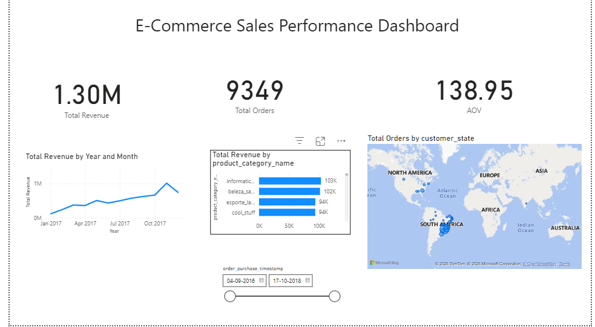

# Power BI E-Commerce Sales Dashboard
## Project Objective
Analyze e-commerce sales data to identify revenue trends, top performing product categories, customer order distribution, and business insights using Power BI dashboards.
This project analyzes e-commerce sales data using Power BI.

## Key Insights
- Total Revenue: $1.3M
- Total Orders: 9,349
- Average Order Value: $138.95

## Dashboard Preview

## Tools Used
Power BI
Data Visualization
DAX
Data Modelling
